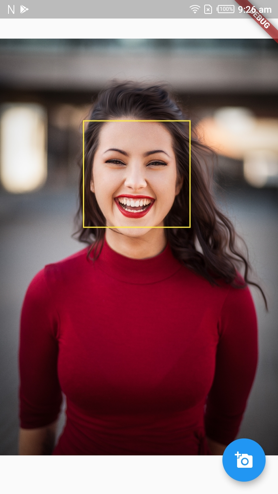

# Flutter Face Detection  

Flutter Face Detection with Firebase ML Kit and CustomPainter.  
Read the article on [Medium](https://medium.com/flutter-community/flutter-face-detection-ac18e3e2211f)  

 

Made with :heart_eyes: by [Akora-IngDKB](https://github.com/Akora-IngDKB).  
Follow me on [Twitter](https://twitter.com/AkoraIng_DKB)    

## Getting Started

This project is a starting point for a Flutter application.

A few resources to get you started if this is your first Flutter project:

- [Lab: Write your first Flutter app](https://flutter.dev/docs/get-started/codelab)
- [Cookbook: Useful Flutter samples](https://flutter.dev/docs/cookbook)

For help getting started with Flutter, view our
[online documentation](https://flutter.dev/docs), which offers tutorials,
samples, guidance on mobile development, and a full API reference.  